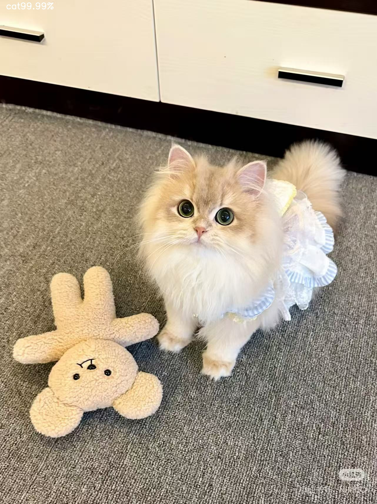

# Cat-dog-classification-by-pytorch

##  Introduce 
A simple image classification model (based on ResNet18) to distinguish cats and dogs, implemented with PyTorch.

## Data Preparation
Labelled data was used to train and test the model

data/ 

 train/
 
 | -- cat 
 
 | -- dog
 
 test/  
 
 | -- cat 
 
 | -- dog


## Training
Run the training script directly:
```bashpython train.py```

## Inference
1.Place test images named infer1.jpg and  infer2.jpg in the project root
2.Run the inference script:
```bashpython infer.py```
3.A result image with Pred and Conf will be generated.(as below for example




