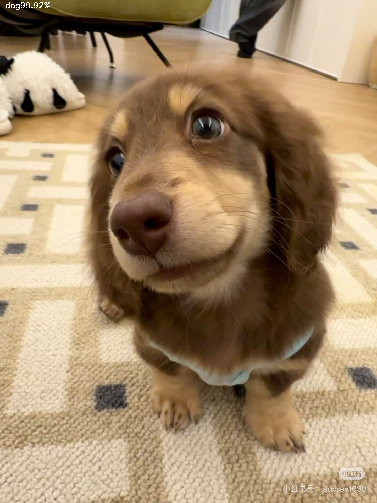

# Cat-dog-classification-by-pytorch
## A simple image classification model (based on ResNet18) to distinguish cats and dogs, implemented with PyTorch.

### Dataset: Kaggle Cats vs. Dogs Dataset

### Prediction example:
- Input: infer2.jpg (a dog image)
- Output: dog (confidence: 99.92%)

